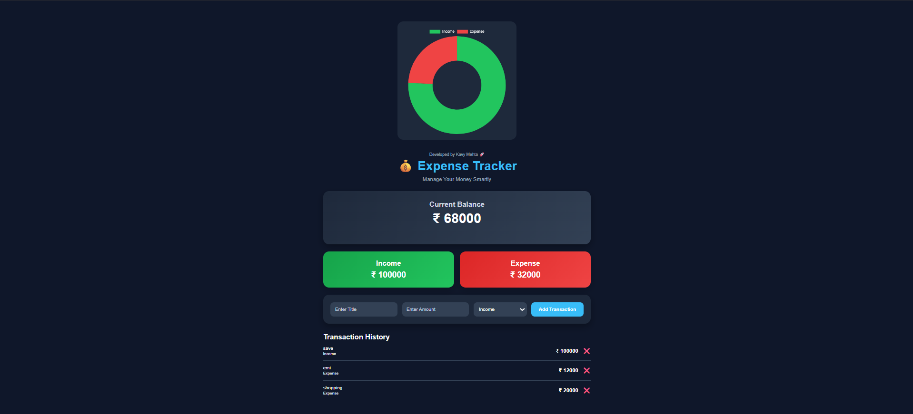

<h1 align="center">Expenses Tracker Web Application</h1>

## 📌 Project Overview
The **Expenses Tracker Web Application** helps users manage their daily income and expenses in a simple and organized way. Users can add transactions, monitor spending habits, and view a clear financial summary through an interactive dashboard.

---

## 🧰 Tech Stack Badges

---

## 📸 Project Preview

---

## 🚀 Key Features

- ✅ Add Income & Expense Transactions  
- 📊 Real-time balance calculation  
- 📜 Transaction history dashboard  
- 🗑️ Delete transactions  
- 📈 Doughnut chart analytics  
- 📱 Responsive modern UI  
- 🧠 Full-stack web application  

---

## 🛠️ Tech Stack

| Technology | Purpose |
|------------|--------|
| Python     | Backend Logic |
| Flask      | Web Framework |
| SQLite     | Database |
| HTML       | Structure |
| CSS        | Styling |
| JavaScript | Dynamic Features |
| Chart.js   | Data Visualization |

---

## 📂 Project Structure

<pre>
expense_tracker/
│
├── app.py
├── database.db
├── README.md
├── screenshot.png
│
├── templates/
│   └── index.html
│
├── static/
│   ├── style.css
│   └── script.js
</pre>

---
## 🚀 Deployment

This project is deployed using **Render**.

---

### 🔗 Live Demo

https://expense-tracker-seoj.onrender.com/

---

## ⚙️ How It Works

### 🎨 Frontend
Users interact with the application through simple forms to add income and expenses. Flask handles the form data and sends it to the backend.

### 🧠 Backend
Flask processes requests, performs calculations, retrieves stored data, and updates the dashboard dynamically.

### 🗄️ Database (SQLite)
SQLite stores all transaction data such as income, expenses, categories, and timestamps in a lightweight database.

---

## 🔮 Future Improvements
- 🔐 User authentication system (Login/Signup)  
- 📄 Export reports to PDF/Excel  
- 🤖 AI-based expense prediction  
- ☁️ Cloud deployment (Render / AWS / Heroku)  
- 📊 Advanced analytics dashboard  

---

## 📌 Conclusion
This project is a simple yet powerful full-stack web application built using Flask and SQLite. It helps users track their income and expenses efficiently and gain better control over their finances.

---

## 🤝 Collaborators
- Kavy Mehta  
- Krishna Belwal
